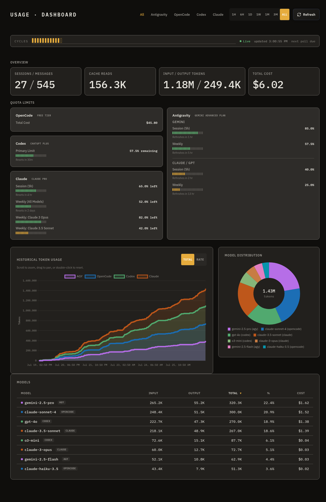

# AI Usage Dashboard

> **One dashboard. Four AI coding agents. Zero cloud dependency.**

Monitor token usage, session stats, cost, and quota limits for **Antigravity (AGY)**, **Claude (Claude Code)**, **OpenCode CLI**, and **Codex CLI (OpenAI)** in a single local real-time dashboard — backed by SQLite, served by FastAPI, rendered with Chart.js.



[](https://www.python.org/)
[](LICENSE)
[](https://github.com/chrischanson/ai-usage-dashboard/actions/workflows/test.yml)

---

## Why

If you run multiple AI coding assistants, tracking quota and spend across separate dashboards is painful. This tool:

- **Polls every 10 minutes** — reads local files/CLI output, no API keys needed for core usage data
- **Keeps history** — 90-day rolling SQLite database with aligned `cycle_ts` intervals
- **Works offline** — everything is local; no vendor SDK, no cloud calls for usage
- **Survives source failures** — if one agent is unavailable, the others keep working
- **Self-heals gaps** — a data integrity monitor carries forward the last valid reading for any missed source

---

## Features

- 📊 **Stacked area chart** (Total mode) and **individual line chart** (Rate mode) for token history
- 🍩 **Donut model distribution** chart — see which models consumed the most tokens
- 🗂️ **Per-source tabs**: All (combined), AGY, Claude, OpenCode, Codex
- ⏱️ **Time range filters**: 1h / 6h / 1d / 1w / 1m / 3m / all
- 💳 **Quota bars** with live plan badge for AGY and Claude; cost display for OpenCode; per-window rate limits for Codex (primary/secondary windows plus any additional metered limits it reports)
- 📱 **Mobile responsive** — container queries plus responsive breakpoints at 1024 px and 640 px
- ♿ **Accessible** — cycle strip live region, `aria-sort` on sortable columns, `role="meter"` quota meters, ARIA roles, keyboard navigation, `:focus-visible`, `prefers-reduced-motion`
- 🔒 **Secure by default** — local-only bind (`127.0.0.1`), CSP headers, no secrets logged

---

## Quick Start

```bash
git clone https://github.com/chrischanson/ai-usage-dashboard
cd ai-usage-dashboard

python3 -m venv venv && source venv/bin/activate
pip install -r requirements.txt

bash run.sh          # foreground — opens at http://127.0.0.1:8000
bash run.sh -b       # background (detached)
```

Or run manually:

```bash
cd backend
PYTHONPATH=. python3 -m main
```

`requirements.txt` pins the exact runtime versions used for deployment;
`pyproject.toml` declares the same runtime set (`fastapi`, `uvicorn`, `httpx`, `pyyaml`)
as `>=` ranges plus a `dev` extra for testing. For development, `pip install -e '.[dev]'`
installs the package and `pytest` together instead of `requirements.txt`.

---

## Data Sources

| Source | Usage | Quota |
|---|---|---|
| **AGY (Antigravity)** | Local conversation `.db` protobuf blobs | Cloud Code RPC + `loadCodeAssist` |
| **Claude (Claude Code)** | Local `~/.claude/projects/**/*.jsonl` transcripts | Anthropic OAuth usage API (`~/.claude/.credentials.json`) |
| **OpenCode CLI** | `opencode stats --models` subprocess | Same subprocess (total cost) |
| **Codex CLI (OpenAI)** | `~/.codex/state_5.sqlite` threads | JWT plan + a short-lived `codex app-server --stdio` session (`account/rateLimits/read`) |

Every source is **optional and isolated** — if a source is absent or fails, the rest of the dashboard keeps working.

---

## Adding a New Source

You can add your own data sources by simply dropping a YAML file into `backend/providers/` and restarting the server. 

The dashboard supports declarative adapters for parsing output from HTTP APIs, local SQLite databases, or subprocess commands. Complex custom integrations are also possible via Python scripts.

**Example (HTTP JSON):**
```yaml
display_name: "My Custom Source"
color: "oklch(0.6 0.15 250)"

usage:
  type: http_json
  url: "https://api.example.com/v1/usage"
  headers:
    Authorization: "Bearer ${MY_API_KEY}"
  mapping:
    input_tokens: ".data.total_input"
    output_tokens: ".data.total_output"
```

For the complete schema, advanced mapping options, and instructions for all adapter types (`subprocess`, `http_json`, `sqlite_query`, `python_script`), please see the **[Provider System Reference](docs/providers.md)**.

---

## Configuration

All settings via environment variables (all have sensible defaults):

| Variable | Default | Description |
|---|---|---|
| `USAGE_DB_PATH` | `backend/usage.db` | SQLite database location |
| `USAGE_POLL_INTERVAL` | `600` | Poll interval in seconds |
| `USAGE_SUBPROCESS_TIMEOUT` | `20` | Timeout for CLI subprocess calls |
| `USAGE_NETWORK_TIMEOUT` | `10` | Timeout for network/quota calls |
| `USAGE_RETENTION_DAYS` | `90` | History pruning window |
| `USAGE_HOST` | `127.0.0.1` | Bind address — loopback-only by default (see Security note below) |
| `USAGE_PORT` | `8000` | Bind port |
| `USAGE_LOG_LEVEL` | `INFO` | Logging level |
| `USAGE_CODEX_BIN` | `codex` | Codex CLI used for `codex app-server --stdio` quota reads. A bare name is resolved on `PATH`, then probed at `~/.local/bin/codex` and `/usr/local/bin/codex`; a path (containing `/`) is used as given. |

**Security note:** there is no authentication on any route, but the default bind is
loopback-only (`127.0.0.1`), so nothing off the host can reach it out of the box. Widen
this deliberately — e.g. `USAGE_HOST=0.0.0.0` to make it LAN/tailnet-reachable — only if
you have a reason to, and put something in front of it (an SSH tunnel or `tailscale
serve`) if the network isn't fully trusted.

**Codex CLI under systemd:** the official Codex installer puts the binary in
`~/.local/bin`, which a systemd unit does not inherit on `PATH`. Set `USAGE_CODEX_BIN`
explicitly to the full path in `/etc/default/usage-dashboard` (template at
`install/usage-dashboard.default`) and run `systemctl restart usage-dashboard` after
changing it — without this, Codex quota degrades to plan-only. `USAGE_NETWORK_TIMEOUT`
also bounds the whole Codex App Server session (spawn, initialize, and the quota read
together), not just plain network calls.

---

## Auto-start on Boot

**systemd** (Linux with systemd):
```bash
sudo bash install/install.sh /path/to/project [user]
sudo systemctl start usage-dashboard
sudo systemctl enable usage-dashboard
```

**SysVinit** (containers, older Linux):
```bash
sudo /etc/init.d/usage-dashboard start
```

---

## Architecture

```
Sources (local files / CLI / RPC)
        │
        ▼
  Poller (10 min cycle)
        │  writes cycle_ts-aligned rows
        ▼
   SQLite DB  ◄──── Data Integrity Monitor (auto-backfills gaps)
        │
        ▼
  FastAPI server  ─────►  Static frontend (Chart.js)
  /api/usage/*            http://127.0.0.1:8000
  /api/quota/*
```

Full design decisions: [DESIGN.md](DESIGN.md)

---

## Testing

```bash
# 322-check integration suite
PYTHONPATH=backend python3 verify.py

# 263 unit tests (plus subtests) — install the dev extra first
pip install -e '.[dev]'   # or: pip install -r requirements-dev.txt
PYTHONPATH=backend python3 -m pytest -q backend/tests
```

A real Codex App Server query (a live `codex app-server --stdio` session against an
installed CLI) is a manual smoke test only — CI mocks Codex and no test requires a real
ChatGPT/Codex account.

---

## Project Structure

```
backend/          FastAPI server, parsers, poller, DB layer, integrity monitor
frontend/
  index.html      Page shell
  index.css       Design tokens, @layer cascade, responsive layout (container queries)
  fonts/          6 self-hosted IBM Plex woff2 files (OFL)
  js/
    main.js       Wiring, event handlers, refresh loop
    state.js      Single mutable state object + constants
    api.js        All fetches
    format.js     Pure formatters
    colors.js     Reads design tokens from CSS custom properties
    charts.js     Both Chart.js configs
    derive.js     Read-time totals/deltas from history
    ui/           Component modules (banners, skeleton, kpis, table, quota, strip)
  chart.js, hammer.js, chartjs-plugin-zoom.js  (vendored)
install/          systemd service + SysVinit scripts
DESIGN.md         Architecture, data model, API spec, build order
verify.py         Integration test suite (322 checks)
run.sh            Convenience launcher (creates venv, installs deps)
```

---

## Regenerating Screenshot

If you need to regenerate the dashboard screenshot, a dedicated agent skill configuration is available in this repository under:
`.claude/skills/generate-dashboard-screenshot/`

This skill provides the workflow and tools to seed mock historical data, temporarily bypass real APIs, and take a clean screenshot of the dashboard.

## Browser Support

The UI uses CSS container queries, so it needs Chrome, Safari, or Firefox from 2023 onward.  
Older browsers will display unstyled content without error.

---

## License

MIT — see [LICENSE](LICENSE).


