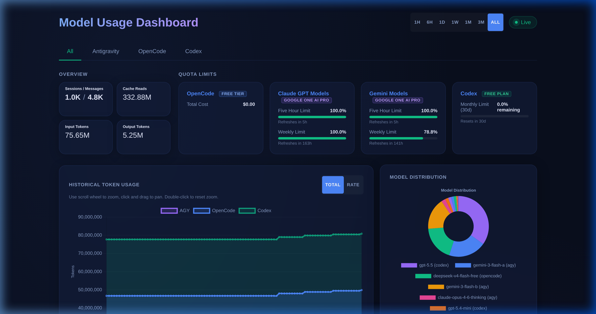

# AI Usage Dashboard

> **One dashboard. Three AI coding agents. Zero cloud dependency.**

Monitor token usage, session stats, cost, and quota limits for **Antigravity (AGY)**, **OpenCode CLI**, and **Codex CLI (OpenAI)** in a single local real-time dashboard — backed by SQLite, served by FastAPI, rendered with Chart.js.



[](https://www.python.org/)
[](LICENSE)
[](https://github.com/chrischanson/ai-usage-dashboard/actions/workflows/test.yml)

---

## Why

If you run multiple AI coding assistants, tracking quota and spend across separate dashboards is painful. This tool:

- **Polls every 10 minutes** — reads local files/CLI output, no API keys needed for core usage data
- **Keeps history** — 90-day rolling SQLite database with aligned `cycle_ts` intervals
- **Works offline** — everything is local; no vendor SDK, no cloud calls for usage
- **Survives source failures** — if one agent is unavailable, the others keep working
- **Self-heals gaps** — a data integrity monitor carries forward the last valid reading for any missed source

---

## Features

- 📊 **Stacked area chart** (Total mode) and **individual line chart** (Rate mode) for token history
- 🍩 **Donut model distribution** chart — see which models consumed the most tokens
- 🗂️ **Per-source tabs**: All (combined), AGY, OpenCode, Codex
- ⏱️ **Time range filters**: 1h / 6h / 1d / 1w / 1m / 3m / all
- 💳 **Quota bars** with live plan badge for AGY; cost display for OpenCode; monthly limit for Codex
- 📱 **Mobile responsive** — single 640 px breakpoint
- ♿ **Accessible** — ARIA roles, keyboard navigation, `:focus-visible`, `prefers-reduced-motion`
- 🔒 **Secure by default** — local-only bind (`127.0.0.1`), CSP headers, no secrets logged

---

## Quick Start

```bash
git clone https://github.com/chrischanson/ai-usage-dashboard
cd ai-usage-dashboard

python3 -m venv venv && source venv/bin/activate
pip install -r requirements.txt

bash run.sh          # foreground — opens at http://127.0.0.1:8000
bash run.sh -b       # background (detached)
```

Or run manually:

```bash
cd backend
PYTHONPATH=. python3 -m main
```

---

## Data Sources

| Source | Usage | Quota |
|---|---|---|
| **AGY (Antigravity)** | Local conversation `.db` protobuf blobs | Cloud Code RPC + `loadCodeAssist` |
| **OpenCode CLI** | `opencode stats --models` subprocess | Same subprocess (total cost) |
| **Codex CLI (OpenAI)** | `~/.codex/state_5.sqlite` threads | JWT plan + `logs_2.sqlite` rate-limit events |

Every source is **optional and isolated** — if a source is absent or fails, the rest of the dashboard keeps working.

---

## Configuration

All settings via environment variables (all have sensible defaults):

| Variable | Default | Description |
|---|---|---|
| `USAGE_DB_PATH` | `backend/usage.db` | SQLite database location |
| `USAGE_POLL_INTERVAL` | `600` | Poll interval in seconds |
| `USAGE_SUBPROCESS_TIMEOUT` | `20` | Timeout for CLI subprocess calls |
| `USAGE_NETWORK_TIMEOUT` | `10` | Timeout for network/quota calls |
| `USAGE_RETENTION_DAYS` | `90` | History pruning window |
| `USAGE_HOST` | `127.0.0.1` | Bind address |
| `USAGE_PORT` | `8000` | Bind port |
| `USAGE_LOG_LEVEL` | `INFO` | Logging level |

---

## Auto-start on Boot

**systemd** (Linux with systemd):
```bash
sudo bash install/install.sh /path/to/project [user]
sudo systemctl start usage-dashboard
sudo systemctl enable usage-dashboard
```

**SysVinit** (containers, older Linux):
```bash
sudo /etc/init.d/usage-dashboard start
```

---

## Architecture

```
Sources (local files / CLI / RPC)
        │
        ▼
  Poller (10 min cycle)
        │  writes cycle_ts-aligned rows
        ▼
   SQLite DB  ◄──── Data Integrity Monitor (auto-backfills gaps)
        │
        ▼
  FastAPI server  ─────►  Static frontend (Chart.js)
  /api/usage/*            http://127.0.0.1:8000
  /api/quota/*
```

Full design decisions: [DESIGN.md](DESIGN.md)

---

## Testing

```bash
# 292-check integration suite
PYTHONPATH=backend python3 verify.py

# Unit tests
PYTHONPATH=backend python3 -m unittest discover -s backend/tests
```

---

## Project Structure

```
backend/          FastAPI server, parsers, poller, DB layer, integrity monitor
frontend/         Static HTML/CSS/JS dashboard (Chart.js, no framework)
install/          systemd service + SysVinit scripts
DESIGN.md         Architecture, data model, API spec, build order
verify.py         Integration test suite (292 checks)
run.sh            Convenience launcher (creates venv, installs deps)
```

---

## License

MIT — see [LICENSE](LICENSE).


